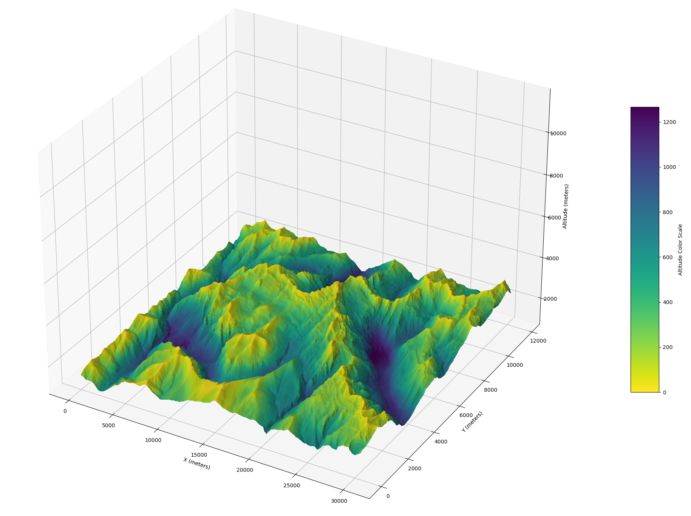

# UAV Satellite Communication Coverage Map
Satellite communication coverage can be determining for the performance of Beyond Line of Sight (BLOS) Unmanned Aerial Vehicles (UAV). One of the critical problems arises when a mountain obstructs the line of sight between the UAV and the Satellite. 
The goal of this project is to draw a map of the minimum altitude over the ground at which there are no mountains covering the sky above the minimum elevation angle of the satellite.
The main script takes a DEM map and a minimum elevation angle, calculates the minimum flying altitudes and plots them in a map. The plot script takes the minimum flying altitudes and plots them directly.

## Example
An example of the Mont Perdut mountain (Pyrenees) is provided, using a DEM map from Copernicus. The next figure shows the resulting 3D map:

 

- **Source**: European Space Agency (2024). *Copernicus Global Digital Elevation Model*. Distributed by OpenTopography. [https://doi.org/10.5069/G9028PQB](https://doi.org/10.5069/G9028PQB). Accessed: 2024-11-03.
